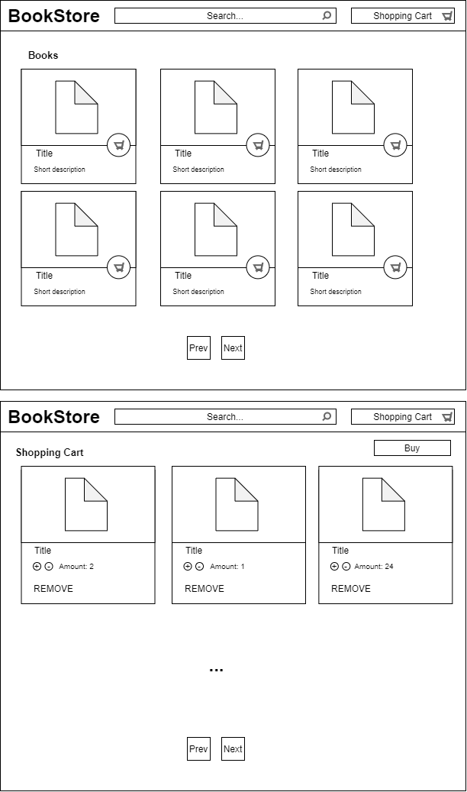
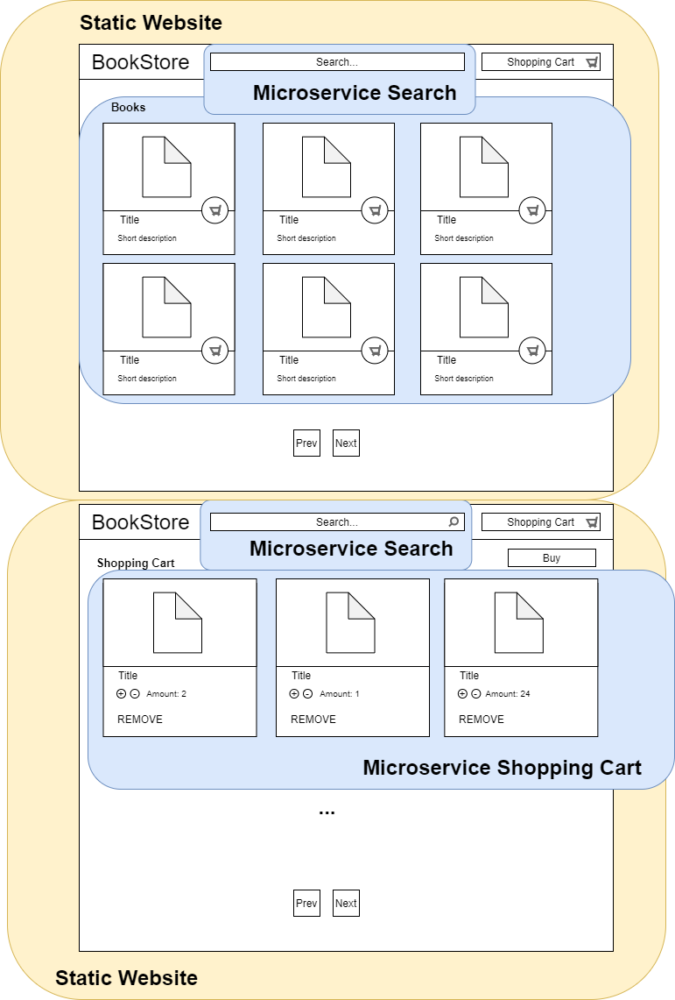
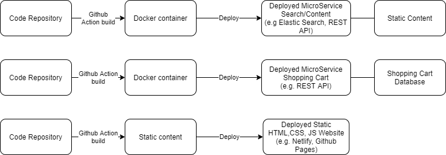

# Cloud Computing Group2

Our project deals with breaking up a traditional monolith, a bookstore web application, into multiple independent microservices
using Docker containers. For this we additionally set up CI build and deployment of the microservices using Github Actions. 

## Team Members
* Christoph Burghuber
* Markus Unterdechler
* Lukas Wais

## Details

A traditional book store application may look like the mockup seen below. 

We take this application and split it into multiple microservices:

* Microservice Search (Docker container) - Processes search requests, paging and displays books on a result.
* Microservice Shopping Cart (Docker container) - Processes the contents of shopping cards 
* Static Website (HTML, CSS, JS) - Contains the static content which dynamically loads data from the micro services if available.

Eventually, the application works like that:

### Deployment

The build and deployment of the microservice will be automated using a simple Git flow using GitHub Actions.

### Workload

In order to make use of our separation into independent microservices, we additionally split up the development of
each microservice into teams. This means each team member listed above is responsible for a single microservice and simulates
an independent development team. Therefore, it might be the case, that the microservices are even developed in different 
programming languages or use different tools.

